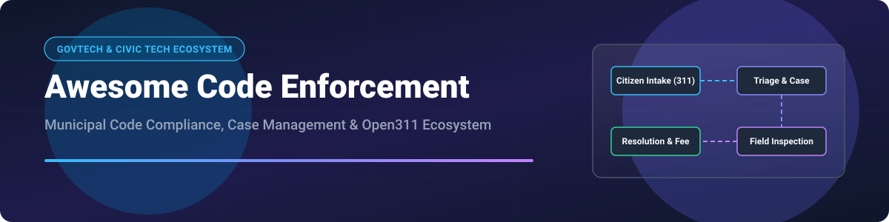

# Awesome Code Enforcement 🏢 Solutions & Open-Source Ecosystem 🚀

  
  
  
  
  

## 📌 Top Code Enforcement Platforms Ecosystem

**Curated List of Municipal Code Enforcement SaaS Platforms, GovTech Software & Open-Source GitHub Projects** 🌟

*Focused on Municipal Code Compliance, Violation Tracking, Citizen 311 Reporting, Case Management & Mobile Field Inspections* 🏛️📱

**Last updated: September 2026** 📅

This repository tracks notable **SaaS platforms** and **open-source projects** for **Code Enforcement** and municipal issue management. These software tools empower local governments, city councils, municipalities, and regulatory agencies to streamline complaint intake, track zoning/building violations, conduct mobile field inspections, issue citations, and enforce compliance with local ordinances and property maintenance standards.

---

## 📑 Table of Contents
- [📊 SaaS/Hosted Platforms](#-saashosted-platforms)
- [💻 Open-Source GitHub Projects](#-open-source-github-projects)
- [🤝 How to Contribute](#-how-to-contribute)
- [☕ Support & Sponsorship](#-support--sponsorship)
- [📈 Star History](#-star-history)
- [⚠️ Disclaimer](#️-disclaimer)

---

## 📊 SaaS/Hosted Platforms

The global municipal government software / GovTech market size is estimated at **$15B - $25B**, with the dedicated Permitting, Licensing, and Code Enforcement (PLCE) sub-sector accounting for approximately **$2B - $3.5B annually**. The market is **moderately to highly fragmented**, dominated by legacy public-sector enterprise suites (Tyler Technologies, CentralSquare, Accela) alongside rapidly growing modern cloud-native SaaS platforms (OpenGov, Clariti, CivicPlus).

| Platform 🏢 | Valuation / Revenue Size 💰 | Starting Pricing Tier 💵 | Free Tier / Trial Limit ⏳ | Key Features & Overview 🔍 |
| :--- | :--- | :--- | :--- | :--- |
| **[Tyler EnerGov](https://www.tylertech.com/)** | **~$24B Market Cap** (~$2.1B annual revenue) | Standard enterprise tier starts at ~$15,000/year (scaled by city population) | No free tier; custom guided demo & proof-of-concept trial upon municipal request | Comprehensive community development suite featuring **iG Enforce** and **iG Inspect** mobile apps. Lake Forest, CA increased online inspection requests by 40%+ using EnerGov. 🏙️ |
| **[CityWorks](https://www.cityworks.com/)** | **~$1B Enterprise Value** (Acquired by Trimble) | Starts at ~$12,000/year base platform licensing | No free tier; 30-day interactive sandbox demo for certified local government administrators | GIS-centric asset management and code enforcement case tracking built directly on Esri ArcGIS spatial architecture. 🌐 |
| **[CentralSquare](https://www.centralsquare.com/)** | **~$800M Revenue** (Backed by Bain Capital & Vista) | Starts at ~$10,000/year per municipal department module | No free tier; customized live environment demo upon municipal request | Public sector suite integrating municipal code enforcement with broader public safety and community development workflows. 🚔 |
| **[OpenGov Code Enforcement](https://opengov.com/products/permitting-and-licensing/building-permit-software/)** | **$1.8B Valuation** (Acquired by Cox Enterprises) | Starts at ~$8,000/year per municipal agency | No free tier; 14-day structured interactive pilot available for government agencies | Cloud-native code enforcement platform with drag-and-drop workflow builders, mobile offline inspections, and direct citizen messaging. Used by 2,000+ local governments. ⚡ |
| **[Accela Code Enforcement](https://www.accela.com/)** | **~$1.5B Valuation** (Acquired by Francisco Partners) | Starts at ~$7,500/year for starter municipal package | No free tier; guided Sandbox demo environment upon request | Robust public-sector code enforcement management platform covering complaint intake, automated penalty billing, real-time KPI dashboards, and AI capabilities. 📊 |
| **[CivicPlus](https://www.civicplus.com/)** | **~$500M Valuation** (Backed by Insight Partners) | Starts at ~$5,000/year for base code enforcement module | No free tier; customized interactive walkthrough & product trial upon request | Civic Experience Platform featuring Municode codification integration, online municipal code hosting, ViewPro Zoning, and SeeClickFix 311 intake. 🏘️ |
| **[CityView](https://www.cityviewsoftware.com/)** | **~$150M Revenue** (Division of Harris Computer / Constellation Software) | Starts at ~$5,000/year for core module | No free tier; scheduled guided interactive demo | Comprehensive permitting, licensing, and code compliance suite with automated case management and citizen self-service portals. 📄 |
| **[SmartGov](https://www.smartgov.com/)** | **~$50M Valuation** (Part of Dude Solutions / Brightly / Siemens) | Starts at ~$4,000/year | No free tier; 30-day guided evaluation environment | Cloud-based government permitting and code enforcement software offering online complaint filing, automated task routing, and inspector scheduling. 📝 |
| **[Clariti](https://www.clariti.app/)** | **~$30M - $50M Valuation** | Starts at ~$3,500/year per agency package | No free tier; 14-day agency evaluation trial upon request | Next-generation community development and permitting platform with built-in code enforcement workflows and mobile officer tools. 🚀 |
| **[CityReporter](https://www.cityreporter.com/)** | **~$5M - $10M Revenue** | Starts at ~$1,500/year (or ~$125/month billed annually) | 30-day full-featured free trial (no credit card required) | Code enforcement and inspection app specifically tailored for small to mid-sized municipalities. Includes complaint tracking and offline mobile field inspection checklists. 📱 |

---

## 💻 Open-Source GitHub Projects

Below are top open-source GitHub repositories for civic reporting, municipal 311 issue tracking, and property code inspection backend frameworks. Repositories are sorted by GitHub Stars_Count in descending order ⭐.

| Open-Source Project 🛠️ | GitHub Stars_Count ⭐ | Description & Features 💡 |
| :--- | :--- | :--- |
| **[mysociety/fixmystreet](https://github.com/mysociety/fixmystreet)** |  | **The premiere open-source platform for citizen issue & code reporting.** Written in Perl/Catalyst. Powers FixMyStreet.com (sent 200,000+ reports to 400+ UK local councils). Open311 client/server API compatible. 🇬🇧 |
| **[markaspot/mark-a-spot](https://github.com/markaspot/mark-a-spot)** |  | **Open-source civic issue tracking & reporting system.** Decoupled Drupal backend with Vue.js PWA frontend. Full Open311 Server API support, geocoding, interactive maps, and municipal status workflows. 📍 |
| **[egovernments/DIGIT-OSS](https://github.com/egovernments/DIGIT-OSS)** |  | **Open-source digital governance platform (eGov/DIGIT).** Includes Citizen Complaint Resolution System (CCRS) and property tax/violation management microservices for urban local bodies. 🏛️ |
| **[AimeeKnight/Civic311](https://github.com/AimeeKnight/Civic311)** |  | **Node.js non-emergency city issue reporting application.** Lightweight framework for public issue reporting, geolocation tagging, and admin management triage. 🏙️ |
| **[codeforamerica/open311-on-joget](https://github.com/codeforamerica/open311-on-joget)** |  | **Open311 backend built on the Joget Workflow Engine.** Includes ready-to-run Joget applications for Open311 complaint forms, administrative data lists, and XML endpoints. ⚙️ |

---

## 🤝 How to Contribute

Contributions are highly appreciated! Help keep this municipal software ecosystem up-to-date 💡:

1. 🍴 Fork the repository.
2. 📝 Add or edit entries in `README.md` (following the existing table formats).
3. 🔗 Include exact product names, official links, pricing details, and factual feature descriptions.
4. 🚀 Open a Pull Request with a clear summary of changes.

---

## ☕ Support & Sponsorship

If you find this curated list helpful for your municipal government research, civic tech projects, or code enforcement software evaluation, please consider supporting the project:

- ⭐ **Star** this repository on GitHub to increase visibility!
- 🔀 **Fork** and share it with fellow civic hackers and urban tech teams.
- ☕ **Buy me a coffee / Sponsor**: If you'd like to support ongoing open-source maintenance, check out the [GitHub Sponsor Dashboard](https://github.com/sponsors/ishandutta2007). Thank you for your support! ❤️

---

## 📈 Star History

---

## ⚠️ Disclaimer

- This list is **community-curated** for informational and educational purposes — it does not constitute an official endorsement. ℹ️
- Code enforcement systems process sensitive property owner information and public record filings; ensure compliance with local government privacy mandates and municipal records retention standards. 🛡️
- **Open-Source Reality**: While tools like **FixMyStreet** and **Mark-a-Spot** excel at **citizen complaint intake and public reporting** via Open311 standards, comprehensive **end-to-end municipal code enforcement workflows** (citation issuing, legal escalation, administrative hearing management, and multi-stage field inspection schedules) are predominantly handled by specialized commercial SaaS solutions or custom enterprise builds. 🏛️
